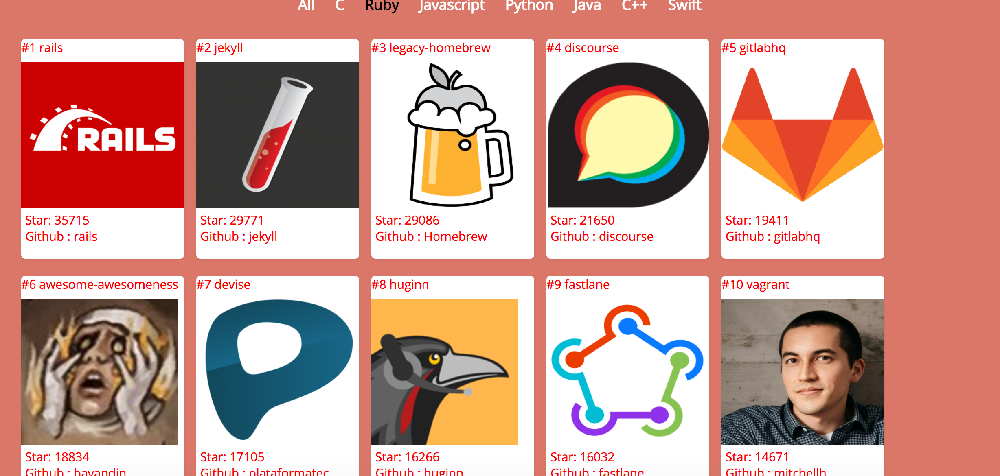

# Github Trending Fetcher

***
Learning react with simple application that fetch github trending as selected language.

Fetch all github trending repositories with repo link, author and author profile picture in awesome UI. You can also choose your favourite language and get trending repositories.




# Installing Dependencies
###### For installing react and react-dom modules as dependencies.

```sh
$ npm install react react-dom
```
###### Installing babel, webpack and other necessary packages.
```sh
$ npm install --save-dev babel-core babel-loader babel-preset-env babel-preset-react css-loader style-loader html-webpack-plugin webpack webpack-dev-server
```
###### running webpack in development
```sh
$ npm run start
```
Runs in 8080 port.

###### Deploying to production
```sh
$ npm build deploy
```
*I have set develop as a deployment branch for production you can also change **line no.8 in package.json** and mention your deployment branch*
